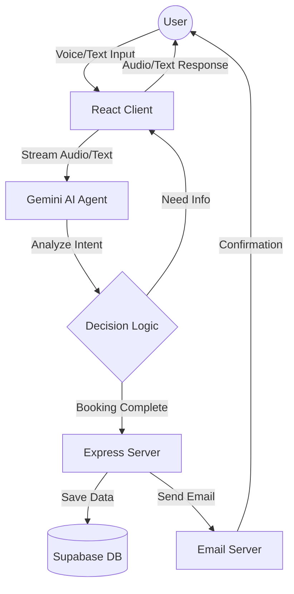

# SRITOURS ASSISTANT - A Multilingual AI Travel Companion
## PROJECT DOCUMENTATION

### TABLE OF CONTENTS

*   **Abstract**
*   **Introduction**
    *   1.1 Project Definition
*   **System Study**
    *   2.1 Existing System
    *   2.2 Proposed System
    *   2.3 Need for Computerization
    *   2.4 Modules
*   **System Specification**
    *   3.1 Hardware Requirement
    *   3.2 Software Requirement
    *   3.3 Special Feature of Language / Utilities
*   **System Design**
    *   4.1 Data Flow Diagram
    *   4.2 Database Design
*   **System Implementation**
    *   5.1 Screen Layout
    *   5.2 Source Code
*   **Testing**
    *   6.1 Testing Description
*   **Conclusion**
*   **References**

---

### Abstract

**Sri Tours Assistant** is a cutting-edge, voice-first travel booking application designed to bridge the digital divide in travel planning. Leveraging advanced Generative AI (Google Gemini 2.0 Flash), the system acts as a multilingual travel consultant capable of conversing naturally in English, Hindi, and Tamil. Unlike traditional static booking forms, this application engages users in real-time dialogue to understand their preferences, budget, and travel dates, thereafter automating the itinerary creation and booking confirmation process via email.

---

### Introduction

#### 1.1 Project Definition
The project aims to develop an intelligent web application, **Sri Tours Assistant**, that simplifies travel booking for diverse user demographics. By integrating Voice AI, the system removes the complexity of navigating multiple filters and forms. Users can simply speak their plans (e.g., "I want a 3-day trip to Goa from Mumbai for my family"), and the assistant processes this intent to suggest itineraries, confirm bookings, and send automated confirmations.

---

### System Study

#### 2.1 Existing System
Traditional travel booking systems rely heavily on:
*   **Static Forms**: Users must manually select destinations, dates, and filters from dropdowns.
*   **Language Barriers**: Most platforms operate primarily in English, excluding non-English speakers.
*   **Complex Navigation**: Users often get lost navigating between flights, hotels, and holiday package pages.
*   **Lack of Personalization**: Generic search results without understanding specific user context or intent.

#### 2.2 Proposed System
The proposed **Sri Tours Assistant** introduces:
*   **Voice-First Interface**: Users interact via natural speech in their native language (Hindi/Tamil/English).
*   **AI-Driven Context**: The system remembers context (e.g., if a user says "change date to next week," it understands which trip is being discussed).
*   **Unified Booking Flow**: A single conversational interface handles flights, hotels, and packages.
*   **Automated Confirmations**: Instant email confirmation with booking details upon successful negotiation.

#### 2.3 Need for Computerization
*   **Efficiency**: Reduces the time taken to plan a trip from hours to minutes.
*   **Accessibility**: Makes travel booking accessible to elderly or less tech-savvy users via voice.
*   **Scalability**: An AI agent can handle unlimited concurrent customer queries compared to human agents.

#### 2.4 Modules
The system comprises the following core modules:
1.  **Home / Discover Module**: A visual grid of trending destinations and categories (Flights, Hotels, etc.) for exploration.
2.  **Category Search Module**: Dedicated forms for specific searches (e.g., specific flight dates) to seed the AI conversation.
3.  **AI Assistant Module (Voice/Chat)**: The core engine powered by Google GenAI that handles dialogue, intent recognition, and tool execution.
4.  **Booking Management Module**: Handles data validation, database storage (Supabase), and email dispatch (Nodemailer).

---

### System Specification

#### 3.1 Hardware Requirement
*   **Server**: Standard Cloud Instance (or Localhost for dev) with internet connectivity.
*   **Client**:
    *   Device: PC, Laptop, or Smartphone.
    *   Input: Microphone (essential for Voice Mode).
    *   Output: Speakers/Headphones.
    *   RAM: Minimum 4GB (for smooth browser performance).

#### 3.2 Software Requirement
*   **Operating System**: Windows / Linux / macOS.
*   **Development Environment**: Visual Studio Code.
*   **Runtime Environment**: Node.js (v18+).
*   **Frontend Framework**: React 19, Vite, Tailwind CSS.
*   **Backend Framework**: Express.js.
*   **AI Model**: Google Gemini 2.0 Flash (via `@google/genai` SDK).
*   **Database**: Supabase (PostgreSQL).
*   **Email Service**: Nodemailer (SMTP).

#### 3.3 Special Feature of Language / Utilities
*   **Google Gemini Multimodal Live API**: Allows low-latency, real-time voice interaction.
*   **React + TypeScript**: Ensures type safety and component-based modular UI.
*   **Tailwind CSS**: Utility-first CSS for rapid, responsive "Glassmorphism" UI design.
*   **Supabase**: Provides a scalable, serverless SQL database with easy API integration.

---

### System Design

#### 4.1 Data Flow Diagram (DFD)

#### 4.2 Database Design
**Table: `bookings`**
| Column Name | Data Type | Description |
| :--- | :--- | :--- |
| `id` | UUID (PK) | Unique Booking ID |
| `created_at` | TIMESTAMP | Date of booking |
| `destination` | TEXT | Target location |
| `travel_date` | DATE | Date of travel |
| `customer_name` | TEXT | Name of user |
| `customer_email` | TEXT | Email for confirmation |
| `mobile` | TEXT | Contact number |
| `status` | TEXT | 'Confirmed' / 'Pending' |

---

### System Implementation

#### 5.1 Screen Layout
The application features a modern, app-like interface:
*   **Home View**: Displays a "Discover" tab with a search bar, category icons (Flights, Hotels), and a grid of "Trending Destinations" with high-quality images.
*   **Voice Mode**: A dedicated screen with a visualizer that animates when the AI speaks, offering a "hands-free" feel.
*   **Category Page**: A simplified form interface for users who prefer typing specific dates/locations before talking to the AI.

#### 5.2 Source Code Structure
*   `App.tsx`: Main entry point managing routing (`HOME`, `CATEGORY`, `ASSISTANT`).
*   `components/VoiceAgent.tsx`: Handles WebRTC audio streaming, microphone access, and Gemini Live API connection.
*   `components/ChatAgent.tsx`: Handles text-based fallback interactions.
*   `server.js`: Node.js Express server handling API endpoints (`/api/booking`, `/api/send-email`).
*   `constants.ts`: Stores system instructions, prompt engineering rules, and destination data.

---

### Testing

#### 6.1 Testing Description
The system underwent rigorous testing to ensure reliability:
1.  **Voice Recognition Test**: Verified the AI's ability to understand Indian accents and mixed languages (Hinglish/Tanglish).
    *   *Result*: AI successfully detected language switches.
2.  **Booking Flow Test**: End-to-end test from "I want to go to Goa" to receiving the email confirmation.
    *   *Result*: Data correctly stored in Supabase and Email received.
3.  **UI Responsiveness**: Tested on Desktop and Mobile viewports.
    *   *Result*: Grid layouts adapted correctly (4 columns on Desktop -> 2 on Mobile).
4.  **Error Handling**: Verified behavior when API keys are missing or network fails.
    *   *Result*: Graceful error messages displayed to the user.

---

### Conclusion
**Sri Tours Assistant** successfully demonstrates the power of Generative AI in transforming customer service. By replacing static forms with a fluid, intelligent conversation, the system captures user intent more accurately and provides a delightful "human-like" experience. The successful integration of voice protocols, multilingual support, and automated backend logistics makes it a robust solution for modern travel agencies.

---

### References
1.  Google Gemini API Documentation: https://ai.google.dev/docs
2.  React Documentation: https://react.dev
3.  Supabase Documentation: https://supabase.com/docs
4.  Tailwind CSS Documentation: https://tailwindcss.com/docs
